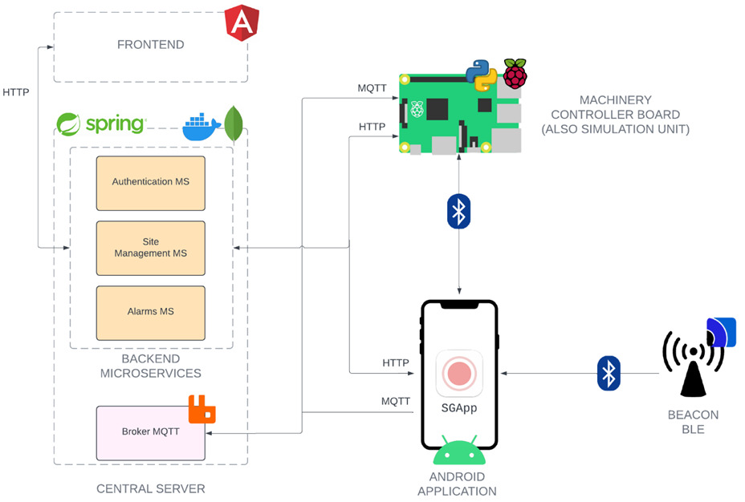

# GROUND WORKERS LOCATION AND IDENTIFICATION SYSTEM

This project aims to develop a Proximity Warning System (PWS) using Bluetooth Low energy (BLE) technology in work contexts where mobile machinery and workers on the ground are present.\
\
The system can detect proximity situations between these subjects in real-time, notifying those concerned in case of danger. Additionally, it supports other types of alarms, including general communications and signaling when drivers are away from machinery.\
\
Furthermore, the system offers functionalities for the management of site resources, allows the definition of a daily configuration of active machines with their authorised drivers, and guarantees secure access to the proximity notifications. Thanks to the software and hardware solutions adopted, it is easily extendable and adaptable to specific needs. 
## Architecture
The system architecture is outlined below:



The developed components are:
* the central server\
https://github.com/UniSalento-IDALab-IoTCourse-2022-2023/wot-project-2022-2023-central_server-accogli_carluccio.git
* the machinery controller board\
https://github.com/UniSalento-IDALab-IoTCourse-2022-2023/wot-project-2022-2023-controller_board-accogli_carluccio.git
* android application\
https://github.com/UniSalento-IDALab-IoTCourse-2022-2023/wot-project-2022-2023-app_android-accogli_carluccio.git
* 🟡(this repo) <b>frontend application </b> 

## THIS REPO: Frontend application
This web application provides the safety manager with four pages:
* <b>"Alert"</b>, a dashboard for viewing generated alarms and performing searches based on various filters. Here, it is also possible to monitor real-time alarms for the current day, analyze cumulative statistics, and send general communications to the drivers.
* <b>"Site Configuration"</b>, for managing the daily configuration.
* <b>"Machineries"</b>, which contains all information about the machines registered in the system, allowing the management of associated beacons and the addition of new ones.
* <b>"Workers"</b>, that displays the data of the present operators and allows the addition of new ones."

## Usage
Make sure that the central server is up, then open this code and type:
```
ng serve
```
The website will be available at http://localhost:4200/.
